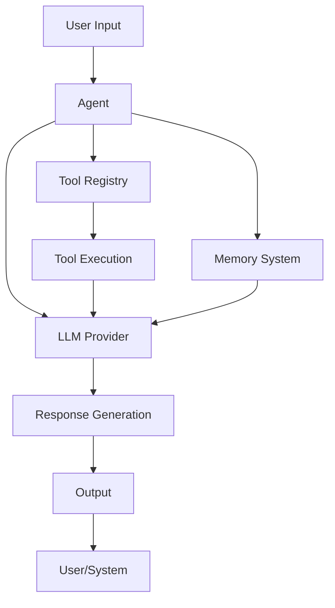

# Agents

The **Agent** is the central component of Niflheim-X. It orchestrates conversations, manages memory, executes tools, and provides a unified interface for AI interactions.

## 🤖 What is an Agent?

An Agent in Niflheim-X is an intelligent conversational entity that can:

- **💬 Have conversations** with users and other agents
- **🧠 Remember context** across interactions
- **🛠️ Use tools** to perform actions and retrieve information
- **🔄 Stream responses** in real-time
- **📊 Emit events** for monitoring and debugging

## 🏗️ Agent Architecture



## 🚀 Creating an Agent

### Basic Agent Setup

```python
from niflheim_x import Agent, OpenAILLM

# Create an LLM instance
llm = OpenAILLM(
    model="gpt-4",
    api_key="your-api-key",
    temperature=0.7
)

# Create an agent
agent = Agent(
    name="MyAssistant",
    llm=llm,
    system_prompt="You are a helpful and knowledgeable assistant."
)
```

### Advanced Agent Configuration

```python
from niflheim_x import Agent, OpenAILLM, SQLiteMemory, ToolRegistry

# Advanced setup with custom memory and tools
agent = Agent(
    name="AdvancedBot",
    llm=OpenAILLM(model="gpt-4"),
    memory=SQLiteMemory("./conversations.db"),
    tool_registry=ToolRegistry(),
    system_prompt="""You are an AI assistant specialized in helping developers.
    You have access to various tools and can help with coding, debugging, and technical questions.
    Always be precise and provide working examples when possible.""",
    max_memory_messages=500,
    enable_streaming=True
)
```

## 💬 Agent Interactions

### Simple Chat

```python
# Basic conversation
response = await agent.chat("Hello! How can you help me today?")
print(response.content)

# Follow-up (agent remembers context)
response = await agent.chat("Can you elaborate on that?")
print(response.content)
```

### Streaming Responses

```python
# Stream responses for real-time UX
async for chunk in agent.stream("Explain quantum computing in detail"):
    if chunk.content:
        print(chunk.content, end="", flush=True)
    
    if chunk.finished:
        print("\n\nResponse complete!")
        break
```

### Batch Processing

```python
# Process multiple messages
messages = [
    "What is machine learning?",
    "How does it differ from AI?",
    "Give me a practical example"
]

responses = await agent.batch_chat(messages)
for i, response in enumerate(responses):
    print(f"Q{i+1}: {messages[i]}")
    print(f"A{i+1}: {response.content}\n")
```

## 🎛️ Agent Configuration Options

### Core Settings

| Parameter | Type | Default | Description |
|-----------|------|---------|-------------|
| `name` | `str` | `"Agent"` | Unique identifier for the agent |
| `llm` | `LLMProvider` | Required | Language model provider |
| `memory` | `MemoryBackend` | `DictMemory()` | Conversation memory backend |
| `system_prompt` | `str` | Default prompt | System instructions for the agent |
| `max_memory_messages` | `int` | `100` | Maximum messages to retain |
| `enable_streaming` | `bool` | `False` | Enable streaming responses |

### LLM Configuration

```python
# OpenAI Configuration
openai_llm = OpenAILLM(
    model="gpt-4-turbo",
    api_key="your-key",
    temperature=0.7,
    max_tokens=2048,
    top_p=1.0,
    frequency_penalty=0.0,
    presence_penalty=0.0
)

# Anthropic Configuration
anthropic_llm = AnthropicLLM(
    model="claude-3-sonnet-20240229",
    api_key="your-key",
    temperature=0.7,
    max_tokens=4096
)

# Custom LLM Provider
class CustomLLM(LLMProvider):
    async def generate_response(self, messages, tools=None):
        # Your custom implementation
        pass
```

## 🛠️ Tool Integration

Agents can use tools to extend their capabilities:

```python
from niflheim_x import Tool

# Define a tool
def search_web(query: str) -> str:
    """Search the web for information."""
    # Implementation here
    return f"Search results for: {query}"

web_search_tool = Tool(
    name="web_search",
    description="Search the web for current information",
    function=search_web,
    parameters={
        "type": "object",
        "properties": {
            "query": {"type": "string", "description": "Search query"}
        },
        "required": ["query"]
    }
)

# Register with agent
agent.register_tool(web_search_tool)

# Agent can now use the tool
response = await agent.chat("What's the latest news about AI?")
```

## 📊 Agent Events and Monitoring

Agents emit events for comprehensive monitoring:

```python
# Set up event listeners
@agent.on('conversation_started')
async def on_conversation_start(data):
    print(f"New conversation started: {data['session_id']}")

@agent.on('tool_called')
async def on_tool_call(data):
    print(f"Tool called: {data['tool_name']} with args: {data['arguments']}")

@agent.on('response_generated')
async def on_response(data):
    print(f"Response generated in {data['duration']}ms using {data['tokens']} tokens")

@agent.on('error')
async def on_error(data):
    print(f"Error occurred: {data['error']}")
    # Send to monitoring system
```

## 🔄 Agent Lifecycle

### Initialization
```python
agent = Agent(name="MyBot", llm=llm)
# Agent is ready to receive messages
```

### Active Phase
```python
# Agent processes messages and maintains state
response = await agent.chat("Hello")
```

### Cleanup
```python
# Cleanup resources
await agent.cleanup()
```

## 🎯 Best Practices

### 1. **Clear System Prompts**
```python
system_prompt = """You are a customer support agent for TechCorp.
Your goal is to help customers resolve technical issues quickly and professionally.

Guidelines:
- Always be polite and helpful
- Ask clarifying questions when needed
- Provide step-by-step solutions
- Escalate complex issues to human agents
- Use tools to access our knowledge base when needed"""
```

### 2. **Appropriate Memory Management**
```python
# For short conversations
agent = Agent(memory=DictMemory(max_messages=50))

# For long-running sessions
agent = Agent(memory=SQLiteMemory("./sessions.db"))

# For semantic search
agent = Agent(memory=VectorMemory(provider="pinecone"))
```

### 3. **Error Handling**
```python
try:
    response = await agent.chat(user_message)
    return response.content
except AgentError as e:
    logger.error(f"Agent error: {e}")
    return "I'm experiencing technical difficulties. Please try again."
except Exception as e:
    logger.error(f"Unexpected error: {e}")
    return "Something went wrong. Our team has been notified."
```

### 4. **Tool Organization**
```python
# Group related tools
class DatabaseTools:
    @staticmethod
    def create_query_tool():
        # Tool implementation
        pass
    
    @staticmethod  
    def create_update_tool():
        # Tool implementation
        pass

# Register tool groups
db_tools = DatabaseTools()
agent.register_tool(db_tools.create_query_tool())
agent.register_tool(db_tools.create_update_tool())
```

## 🔍 Debugging Agents

### Enable Debug Mode
```python
import logging
logging.basicConfig(level=logging.DEBUG)

agent = Agent(name="DebugBot", llm=llm, debug=True)
```

### Inspect Agent State
```python
# Get agent information
info = agent.get_info()
print(f"Agent: {info['name']}")
print(f"Messages: {info['message_count']}")
print(f"Tools: {len(info['registered_tools'])}")

# Get conversation history
history = agent.get_conversation_history()
for msg in history:
    print(f"{msg.role}: {msg.content}")
```

## 🚀 Next Steps

- Learn about [Memory Systems](./memory) for persistent conversations
- Explore [Tool Creation](./tools) for extending agent capabilities  
- Understand [LLM Providers](./llms) for different AI models
- Check out [Enterprise Features](../enterprise/observability) for production deployments