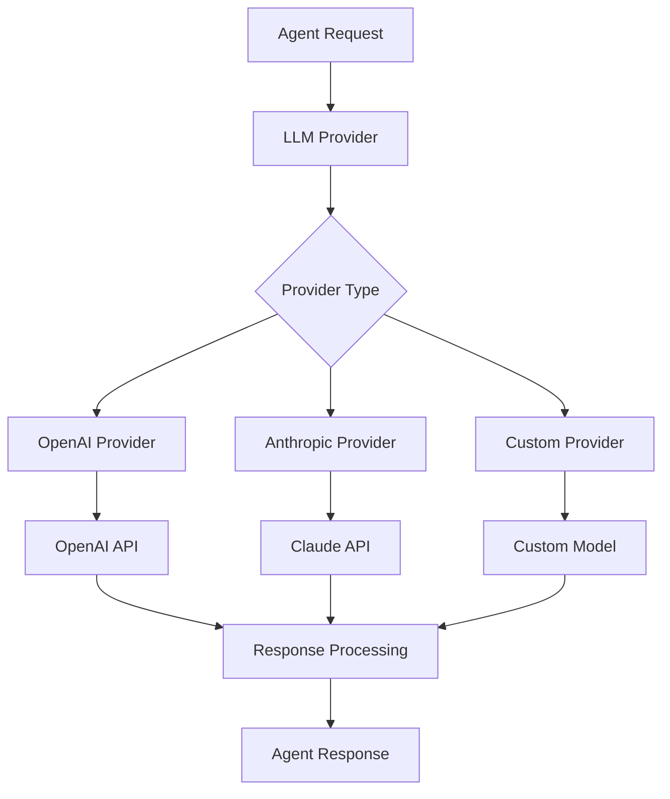

# LLM Providers

LLM Providers are the backbone of Niflheim-X, enabling integration with various language models from different vendors. The framework supports a unified interface for multiple providers.

## 🤖 What are LLM Providers?

LLM Providers in Niflheim-X handle:

- **🔌 Connection** to different AI model APIs
- **🔄 Request/Response** formatting and parsing
- **⚡ Streaming** support for real-time responses
- **🛡️ Error handling** and retry logic
- **📊 Usage tracking** and monitoring
- **💰 Cost optimization** and rate limiting

## 🏗️ Provider Architecture



## 📋 Supported Providers

### 1. **OpenAI Provider**

Most popular provider with GPT models:

```python
from niflheim_x import OpenAILLM

# Basic setup
openai_llm = OpenAILLM(
    model="gpt-4",
    api_key="sk-your-api-key-here",
    temperature=0.7
)

# Advanced configuration
openai_llm = OpenAILLM(
    model="gpt-4-turbo",
    api_key="sk-your-api-key-here",
    temperature=0.7,
    max_tokens=2048,
    top_p=1.0,
    frequency_penalty=0.0,
    presence_penalty=0.0,
    timeout=30,
    max_retries=3,
    organization="org-your-org-id"
)

# Available models
models = [
    "gpt-4",
    "gpt-4-turbo", 
    "gpt-4-turbo-preview",
    "gpt-3.5-turbo",
    "gpt-3.5-turbo-16k"
]
```

**Features:**
- ✅ Function calling / Tool support
- ✅ Streaming responses  
- ✅ Vision capabilities (GPT-4V)
- ✅ JSON mode
- ✅ Extensive model selection

### 2. **Anthropic Provider**

Claude models with advanced reasoning:

```python
from niflheim_x import AnthropicLLM

# Basic setup
anthropic_llm = AnthropicLLM(
    model="claude-3-sonnet-20240229",
    api_key="sk-ant-your-api-key",
    temperature=0.7
)

# Advanced configuration
anthropic_llm = AnthropicLLM(
    model="claude-3-opus-20240229",
    api_key="sk-ant-your-api-key",
    temperature=0.7,
    max_tokens=4096,
    top_p=1.0,
    timeout=60,
    max_retries=3
)

# Available models
models = [
    "claude-3-opus-20240229",     # Most capable
    "claude-3-sonnet-20240229",   # Balanced
    "claude-3-haiku-20240307",    # Fast & efficient
    "claude-2.1",                 # Previous generation
    "claude-instant-1.2"          # Legacy fast model
]
```

**Features:**
- ✅ Large context windows (200K+ tokens)
- ✅ Advanced reasoning capabilities
- ✅ Function calling
- ✅ Streaming responses
- ✅ Constitutional AI safety

### 3. **Custom Provider**

Create your own provider for any API:

```python
from niflheim_x import LLMProvider, Message, LLMResponse
from typing import List, Optional, AsyncIterator
import httpx

class CustomLLM(LLMProvider):
    def __init__(
        self,
        api_url: str,
        api_key: str,
        model: str,
        temperature: float = 0.7,
        **kwargs
    ):
        self.api_url = api_url
        self.api_key = api_key
        self.model = model
        self.temperature = temperature
        self.client = httpx.AsyncClient(timeout=30)
    
    async def generate_response(
        self,
        messages: List[Message],
        tools: Optional[List[dict]] = None,
        **kwargs
    ) -> LLMResponse:
        """Generate a response from the custom API."""
        try:
            # Format request according to your API
            payload = {
                "model": self.model,
                "messages": [
                    {"role": msg.role, "content": msg.content}
                    for msg in messages
                ],
                "temperature": self.temperature,
                "tools": tools or []
            }
            
            headers = {
                "Authorization": f"Bearer {self.api_key}",
                "Content-Type": "application/json"
            }
            
            response = await self.client.post(
                f"{self.api_url}/chat/completions",
                json=payload,
                headers=headers
            )
            response.raise_for_status()
            
            data = response.json()
            
            # Parse response according to your API format
            content = data["choices"][0]["message"]["content"]
            usage = data.get("usage", {})
            
            return LLMResponse(
                content=content,
                role="assistant",
                model=self.model,
                usage={
                    "prompt_tokens": usage.get("prompt_tokens", 0),
                    "completion_tokens": usage.get("completion_tokens", 0),
                    "total_tokens": usage.get("total_tokens", 0)
                },
                finish_reason=data["choices"][0].get("finish_reason")
            )
            
        except Exception as e:
            raise LLMError(f"Custom LLM error: {str(e)}")
    
    async def stream_response(
        self,
        messages: List[Message],
        tools: Optional[List[dict]] = None,
        **kwargs
    ) -> AsyncIterator[LLMResponse]:
        """Stream responses from the custom API."""
        # Implement streaming logic
        payload = {
            "model": self.model,
            "messages": [
                {"role": msg.role, "content": msg.content}
                for msg in messages
            ],
            "temperature": self.temperature,
            "stream": True
        }
        
        async with self.client.stream(
            "POST",
            f"{self.api_url}/chat/completions",
            json=payload,
            headers={"Authorization": f"Bearer {self.api_key}"}
        ) as stream:
            async for line in stream.aiter_lines():
                if line.startswith("data: "):
                    chunk_data = line[6:]  # Remove "data: " prefix
                    if chunk_data == "[DONE]":
                        break
                    
                    try:
                        chunk = json.loads(chunk_data)
                        delta = chunk["choices"][0]["delta"]
                        
                        if "content" in delta:
                            yield LLMResponse(
                                content=delta["content"],
                                role="assistant",
                                model=self.model,
                                is_partial=True
                            )
                    except:
                        continue

# Use custom provider
custom_llm = CustomLLM(
    api_url="https://api.your-provider.com",
    api_key="your-api-key",
    model="your-model-name"
)

agent = Agent(name="CustomBot", llm=custom_llm)
```

## ⚙️ Provider Configuration

### Environment Variables

```python
import os
from niflheim_x import OpenAILLM, AnthropicLLM

# Use environment variables for security
openai_llm = OpenAILLM(
    model="gpt-4",
    api_key=os.getenv("OPENAI_API_KEY"),
    organization=os.getenv("OPENAI_ORG_ID")
)

anthropic_llm = AnthropicLLM(
    model="claude-3-sonnet-20240229",
    api_key=os.getenv("ANTHROPIC_API_KEY")
)
```

### Provider Factory

```python
from niflheim_x import LLMProviderFactory

class LLMFactory:
    @staticmethod
    def create_provider(provider_type: str, **config) -> LLMProvider:
        """Create LLM provider based on type."""
        if provider_type == "openai":
            return OpenAILLM(
                model=config.get("model", "gpt-4"),
                api_key=config["api_key"],
                temperature=config.get("temperature", 0.7)
            )
        elif provider_type == "anthropic":
            return AnthropicLLM(
                model=config.get("model", "claude-3-sonnet-20240229"),
                api_key=config["api_key"],
                temperature=config.get("temperature", 0.7)
            )
        else:
            raise ValueError(f"Unsupported provider: {provider_type}")

# Usage
config = {
    "provider": "openai",
    "model": "gpt-4-turbo",
    "api_key": os.getenv("OPENAI_API_KEY"),
    "temperature": 0.7
}

llm = LLMFactory.create_provider(**config)
```

### Multi-Provider Setup

```python
from niflheim_x import Agent, MultiLLMProvider

# Create multiple providers
providers = {
    "fast": OpenAILLM(model="gpt-3.5-turbo", api_key="..."),
    "smart": OpenAILLM(model="gpt-4", api_key="..."),
    "creative": AnthropicLLM(model="claude-3-opus-20240229", api_key="...")
}

# Multi-provider with routing logic
class SmartRouter(MultiLLMProvider):
    def __init__(self, providers: dict):
        self.providers = providers
    
    async def route_request(self, messages: List[Message], **kwargs) -> str:
        """Route request to appropriate provider."""
        last_message = messages[-1].content.lower()
        
        # Route based on content
        if any(word in last_message for word in ["quick", "fast", "simple"]):
            return "fast"
        elif any(word in last_message for word in ["complex", "analyze", "think"]):
            return "smart"
        elif any(word in last_message for word in ["creative", "story", "poem"]):
            return "creative"
        else:
            return "smart"  # Default

multi_llm = SmartRouter(providers)
agent = Agent(name="SmartBot", llm=multi_llm)
```

## 🔧 Advanced Features

### Function Calling / Tools

```python
# OpenAI function calling
tools = [
    {
        "type": "function",
        "function": {
            "name": "get_weather",
            "description": "Get weather for a location",
            "parameters": {
                "type": "object",
                "properties": {
                    "location": {
                        "type": "string",
                        "description": "City name"
                    }
                },
                "required": ["location"]
            }
        }
    }
]

response = await openai_llm.generate_response(
    messages=messages,
    tools=tools,
    tool_choice="auto"
)

# Handle tool calls
if response.tool_calls:
    for tool_call in response.tool_calls:
        function_name = tool_call.function.name
        arguments = tool_call.function.arguments
        # Execute tool and add result to conversation
```

### Streaming Responses

```python
# Stream responses for better UX
async def handle_streaming():
    messages = [Message(role="user", content="Explain quantum computing")]
    
    async for chunk in openai_llm.stream_response(messages):
        if chunk.content:
            print(chunk.content, end="", flush=True)
        
        if chunk.finish_reason:
            print(f"\nFinished: {chunk.finish_reason}")
            break

await handle_streaming()
```

### Vision Capabilities

```python
# GPT-4 Vision
messages = [
    Message(
        role="user",
        content=[
            {"type": "text", "text": "What's in this image?"},
            {
                "type": "image_url",
                "image_url": {
                    "url": "https://example.com/image.jpg"
                }
            }
        ]
    )
]

response = await openai_llm.generate_response(messages)
print(response.content)
```

### JSON Mode

```python
# Force JSON output
response = await openai_llm.generate_response(
    messages=messages,
    response_format={"type": "json_object"}
)

# Parse JSON response
import json
data = json.loads(response.content)
```

## 📊 Provider Monitoring

### Usage Tracking

```python
from niflheim_x import LLMMonitor

class MonitoredLLM(OpenAILLM):
    def __init__(self, *args, **kwargs):
        super().__init__(*args, **kwargs)
        self.monitor = LLMMonitor()
    
    async def generate_response(self, messages, **kwargs):
        start_time = time.time()
        
        try:
            response = await super().generate_response(messages, **kwargs)
            
            # Track successful request
            self.monitor.record_request(
                provider="openai",
                model=self.model,
                tokens=response.usage["total_tokens"],
                duration=time.time() - start_time,
                success=True
            )
            
            return response
            
        except Exception as e:
            # Track failed request
            self.monitor.record_request(
                provider="openai",
                model=self.model,
                duration=time.time() - start_time,
                success=False,
                error=str(e)
            )
            raise

# Get usage statistics
stats = monitor.get_stats()
print(f"Total requests: {stats['total_requests']}")
print(f"Success rate: {stats['success_rate']:.2%}")
print(f"Total tokens: {stats['total_tokens']}")
print(f"Average latency: {stats['avg_latency']:.2f}s")
```

### Cost Tracking

```python
class CostTracker:
    # OpenAI pricing (as of 2024)
    PRICING = {
        "gpt-4": {"input": 0.03, "output": 0.06},          # per 1K tokens
        "gpt-4-turbo": {"input": 0.01, "output": 0.03},
        "gpt-3.5-turbo": {"input": 0.0015, "output": 0.002},
    }
    
    def __init__(self):
        self.total_cost = 0.0
        self.requests = []
    
    def calculate_cost(self, model: str, usage: dict) -> float:
        """Calculate cost for a request."""
        pricing = self.PRICING.get(model, {"input": 0, "output": 0})
        
        input_cost = (usage["prompt_tokens"] / 1000) * pricing["input"]
        output_cost = (usage["completion_tokens"] / 1000) * pricing["output"]
        
        return input_cost + output_cost
    
    def track_request(self, model: str, usage: dict, timestamp: float):
        """Track a request for cost calculation."""
        cost = self.calculate_cost(model, usage)
        self.total_cost += cost
        
        self.requests.append({
            "timestamp": timestamp,
            "model": model,
            "usage": usage,
            "cost": cost
        })
    
    def get_daily_cost(self) -> float:
        """Get cost for the current day."""
        today = datetime.now().date()
        daily_requests = [
            req for req in self.requests
            if datetime.fromtimestamp(req["timestamp"]).date() == today
        ]
        return sum(req["cost"] for req in daily_requests)

# Use cost tracker
cost_tracker = CostTracker()

class CostAwareLLM(OpenAILLM):
    async def generate_response(self, messages, **kwargs):
        response = await super().generate_response(messages, **kwargs)
        
        cost_tracker.track_request(
            model=self.model,
            usage=response.usage,
            timestamp=time.time()
        )
        
        return response
```

## 🎯 Best Practices

### 1. **Model Selection**

```python
# Choose models based on use case
models_by_use_case = {
    "simple_qa": "gpt-3.5-turbo",           # Fast & cheap
    "complex_reasoning": "gpt-4",           # Most capable
    "code_generation": "gpt-4-turbo",       # Good balance
    "creative_writing": "claude-3-opus",    # Creative tasks
    "document_analysis": "claude-3-sonnet", # Large context
    "real_time_chat": "gpt-3.5-turbo"      # Low latency
}

def get_optimal_model(task_type: str) -> str:
    return models_by_use_case.get(task_type, "gpt-4")
```

### 2. **Error Handling**

```python
from niflheim_x import LLMError, RateLimitError, AuthenticationError

async def robust_llm_call(llm, messages):
    try:
        return await llm.generate_response(messages)
    
    except RateLimitError as e:
        # Wait and retry
        await asyncio.sleep(60)
        return await llm.generate_response(messages)
    
    except AuthenticationError as e:
        # Check API key
        logger.error(f"Authentication failed: {e}")
        raise
    
    except LLMError as e:
        # General LLM error
        logger.error(f"LLM error: {e}")
        return LLMResponse(content="I'm experiencing technical difficulties.")
    
    except Exception as e:
        # Unexpected error
        logger.error(f"Unexpected error: {e}")
        raise
```

### 3. **Performance Optimization**

```python
# Connection pooling
import httpx

class OptimizedOpenAILLM(OpenAILLM):
    def __init__(self, *args, **kwargs):
        super().__init__(*args, **kwargs)
        
        # Use connection pooling
        self.client = httpx.AsyncClient(
            limits=httpx.Limits(
                max_keepalive_connections=10,
                max_connections=20
            ),
            timeout=30
        )

# Caching responses
from functools import lru_cache
import hashlib

class CachedLLM(OpenAILLM):
    def __init__(self, *args, **kwargs):
        super().__init__(*args, **kwargs)
        self.cache = {}
    
    def _cache_key(self, messages, **kwargs):
        """Generate cache key for request."""
        content = "".join(msg.content for msg in messages)
        key_data = f"{content}:{self.model}:{kwargs}"
        return hashlib.md5(key_data.encode()).hexdigest()
    
    async def generate_response(self, messages, **kwargs):
        cache_key = self._cache_key(messages, **kwargs)
        
        if cache_key in self.cache:
            return self.cache[cache_key]
        
        response = await super().generate_response(messages, **kwargs)
        self.cache[cache_key] = response
        
        return response
```

## 🚀 Next Steps

- Explore [Enterprise Features](../enterprise/observability) for production monitoring
- Learn about [Performance Optimization](../guides/performance) for scaling
- Check out [API Reference](../api/llm-providers) for detailed documentation  
- See [Examples](../examples/llm-providers) for advanced use cases