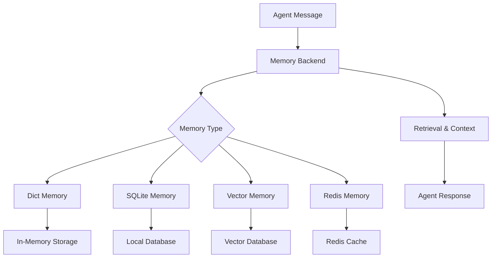

# Memory Systems

Memory is crucial for creating conversational AI that maintains context across interactions. Niflheim-X provides flexible memory backends for different use cases.

## 🧠 What is Memory?

Memory in Niflheim-X stores and retrieves conversation history, enabling agents to:

- **📖 Remember** previous conversations
- **🔍 Search** through conversation history
- **🧩 Maintain context** across sessions
- **💾 Persist** conversations between restarts
- **🎯 Retrieve relevant** information semantically

## 🏗️ Memory Architecture



## 📋 Memory Types

### 1. **DictMemory** - Simple In-Memory Storage

Perfect for development and short-lived conversations:

```python
from niflheim_x import DictMemory, Agent

# Create simple memory
memory = DictMemory(max_messages=100)

agent = Agent(
    name="ChatBot",
    llm=llm,
    memory=memory
)

# Memory is lost when process ends
```

**Use Cases:**
- ✅ Development and testing
- ✅ Short conversations
- ✅ Stateless applications
- ❌ Production environments
- ❌ Long-term storage

### 2. **SQLiteMemory** - Persistent Local Storage

Ideal for single-user applications with persistence:

```python
from niflheim_x import SQLiteMemory

# Create persistent memory
memory = SQLiteMemory(
    db_path="./conversations.db",
    session_id="user_123",
    max_messages=1000
)

agent = Agent(name="PersistentBot", llm=llm, memory=memory)

# Conversations persist across restarts
```

**Use Cases:**
- ✅ Desktop applications
- ✅ Personal assistants
- ✅ Development with persistence
- ✅ Single-user systems
- ❌ Multi-user applications
- ❌ Distributed systems

### 3. **VectorMemory** - Semantic Search

Best for large knowledge bases and semantic retrieval:

```python
from niflheim_x import VectorMemory

# Create vector memory with embeddings
memory = VectorMemory(
    provider="openai",  # or "pinecone", "chroma", "weaviate"
    api_key="your-openai-key",
    index_name="conversations",
    dimension=1536,
    similarity_threshold=0.8
)

agent = Agent(name="SemanticBot", llm=llm, memory=memory)

# Retrieves semantically similar conversations
```

**Use Cases:**
- ✅ Large knowledge bases
- ✅ Semantic search
- ✅ Long conversation histories
- ✅ Context-aware responses
- ❌ Simple chat applications
- ❌ Resource-constrained environments

### 4. **RedisMemory** - Distributed Cache

Perfect for scalable, multi-user applications:

```python
from niflheim_x import RedisMemory

# Create distributed memory
memory = RedisMemory(
    host="localhost",
    port=6379,
    db=0,
    session_id="session_456",
    ttl=3600  # 1 hour expiration
)

agent = Agent(name="ScalableBot", llm=llm, memory=memory)

# Shared across multiple instances
```

**Use Cases:**
- ✅ Multi-user applications
- ✅ Microservices
- ✅ Scalable deployments
- ✅ Session management
- ❌ Simple applications
- ❌ Offline usage

## 🛠️ Memory Configuration

### Basic Configuration

```python
# DictMemory - Simplest setup
memory = DictMemory(max_messages=50)

# SQLiteMemory - Local persistence
memory = SQLiteMemory(
    db_path="./data/conversations.db",
    session_id="unique_session_id"
)

# VectorMemory - Semantic search
memory = VectorMemory(
    provider="openai",
    api_key="sk-...",
    model="text-embedding-ada-002"
)

# RedisMemory - Distributed
memory = RedisMemory(
    host="redis.example.com",
    port=6379,
    password="your-password"
)
```

### Advanced Configuration

```python
# SQLite with custom settings
memory = SQLiteMemory(
    db_path="./conversations.db",
    session_id="user_123",
    max_messages=1000,
    cleanup_threshold=1200,  # Cleanup when exceeding this
    compression=True,        # Compress old messages
    encryption_key="secret"  # Encrypt stored data
)

# Vector memory with multiple providers
memory = VectorMemory(
    provider="pinecone",
    api_key="your-pinecone-key",
    environment="us-west1-gcp",
    index_name="conversations",
    dimension=1536,
    metric="cosine",
    similarity_threshold=0.75,
    max_results=10
)

# Redis with clustering
memory = RedisMemory(
    hosts=[
        {"host": "redis1.example.com", "port": 6379},
        {"host": "redis2.example.com", "port": 6379},
        {"host": "redis3.example.com", "port": 6379}
    ],
    session_id="distributed_session",
    ttl=7200,
    max_connections=10
)
```

## 💡 Memory Usage Patterns

### Session Management

```python
from niflheim_x import Agent, SQLiteMemory

class ConversationManager:
    def __init__(self, llm):
        self.llm = llm
        self.agents = {}
    
    def get_agent(self, user_id: str) -> Agent:
        if user_id not in self.agents:
            memory = SQLiteMemory(
                db_path=f"./data/user_{user_id}.db",
                session_id=user_id
            )
            self.agents[user_id] = Agent(
                name=f"Agent_{user_id}",
                llm=self.llm,
                memory=memory
            )
        return self.agents[user_id]

# Usage
manager = ConversationManager(llm)
user_agent = manager.get_agent("user_123")
response = await user_agent.chat("Hello!")
```

### Context-Aware Retrieval

```python
# Vector memory for semantic search
memory = VectorMemory(provider="openai", api_key="...")

agent = Agent(name="ContextBot", llm=llm, memory=memory)

# The agent automatically retrieves relevant context
await agent.chat("I need help with Python lists")
# Memory searches for similar past conversations about Python

await agent.chat("How do I append items?")
# Retrieves previous Python discussion for context
```

### Multi-Modal Memory

```python
from niflheim_x import MultiModalMemory

# Store different types of content
memory = MultiModalMemory(
    text_backend=VectorMemory(provider="openai"),
    image_backend=VectorMemory(provider="clip"),
    file_backend=SQLiteMemory(db_path="./files.db")
)

agent = Agent(name="MultiModalBot", llm=llm, memory=memory)

# Handles text, images, and files
await agent.chat("Remember this document", attachments=["report.pdf"])
await agent.chat("What was in that report about Q3 sales?")
```

## 🔧 Custom Memory Backends

Create your own memory backend by implementing the `MemoryBackend` interface:

```python
from niflheim_x import MemoryBackend, Message
from typing import List, Optional

class CustomMemory(MemoryBackend):
    def __init__(self, custom_config):
        self.config = custom_config
        self.storage = {}
    
    async def add_message(self, message: Message) -> None:
        """Store a message in memory."""
        session_id = message.session_id or "default"
        if session_id not in self.storage:
            self.storage[session_id] = []
        
        self.storage[session_id].append(message)
        
        # Implement your custom storage logic
        await self._persist_message(message)
    
    async def get_messages(
        self, 
        session_id: str, 
        limit: Optional[int] = None
    ) -> List[Message]:
        """Retrieve messages from memory."""
        messages = self.storage.get(session_id, [])
        
        if limit:
            messages = messages[-limit:]
        
        return messages
    
    async def search_messages(
        self, 
        query: str, 
        session_id: Optional[str] = None,
        limit: int = 10
    ) -> List[Message]:
        """Search messages by content."""
        # Implement your search logic
        all_messages = []
        
        if session_id:
            all_messages = self.storage.get(session_id, [])
        else:
            for messages in self.storage.values():
                all_messages.extend(messages)
        
        # Simple text search (implement better search as needed)
        matching = [
            msg for msg in all_messages 
            if query.lower() in msg.content.lower()
        ]
        
        return matching[:limit]
    
    async def clear_session(self, session_id: str) -> None:
        """Clear all messages for a session."""
        if session_id in self.storage:
            del self.storage[session_id]
    
    async def _persist_message(self, message: Message):
        """Custom persistence logic."""
        # Implement your storage mechanism
        pass

# Use your custom memory
custom_memory = CustomMemory(custom_config={"key": "value"})
agent = Agent(name="CustomBot", llm=llm, memory=custom_memory)
```

## 📊 Memory Monitoring

### Memory Metrics

```python
# Get memory statistics
memory_stats = await memory.get_stats()
print(f"Total messages: {memory_stats['total_messages']}")
print(f"Active sessions: {memory_stats['active_sessions']}")
print(f"Memory usage: {memory_stats['memory_usage_mb']}MB")

# Session-specific stats
session_stats = await memory.get_session_stats("user_123")
print(f"Session messages: {session_stats['message_count']}")
print(f"Session duration: {session_stats['duration_hours']}h")
```

### Memory Cleanup

```python
# Automatic cleanup for SQLite
memory = SQLiteMemory(
    db_path="./conversations.db",
    auto_cleanup=True,
    cleanup_interval=3600,  # Every hour
    max_age_days=30,        # Delete messages older than 30 days
    max_messages_per_session=1000
)

# Manual cleanup
await memory.cleanup_old_messages(max_age_days=7)
await memory.cleanup_session("inactive_session")
```

## 🎯 Memory Best Practices

### 1. **Choose the Right Backend**

```python
# Development & Testing
memory = DictMemory()

# Personal/Desktop Apps
memory = SQLiteMemory("./app_data.db")

# Enterprise/Production
memory = RedisMemory(host="redis-cluster.internal")

# AI-Powered Applications
memory = VectorMemory(provider="pinecone")
```

### 2. **Manage Memory Size**

```python
# Set appropriate limits
memory = SQLiteMemory(
    db_path="./conversations.db",
    max_messages=500,           # Per session
    cleanup_threshold=600,      # Trigger cleanup
    compression=True            # Compress old messages
)
```

### 3. **Handle Sessions Properly**

```python
# Unique session IDs
import uuid

session_id = str(uuid.uuid4())
memory = SQLiteMemory(db_path="./data.db", session_id=session_id)

# Or use user-based sessions
session_id = f"user_{user_id}_{datetime.now().strftime('%Y%m%d')}"
```

### 4. **Error Handling**

```python
try:
    await memory.add_message(message)
except MemoryError as e:
    logger.error(f"Memory storage failed: {e}")
    # Fallback to in-memory storage
    fallback_memory = DictMemory()
    await fallback_memory.add_message(message)
```

## 🚀 Next Steps

- Explore [Tool Systems](./tools) for extending agent capabilities
- Learn about [LLM Providers](./llms) for different AI models
- Check out [Enterprise Features](../enterprise/observability) for production monitoring
- See [Performance Optimization](../guides/performance) for scaling memory systems