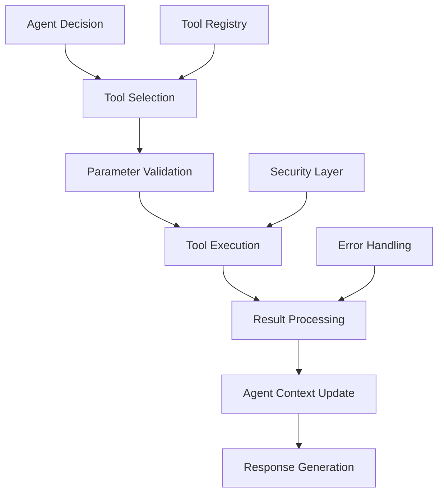

# Tools

Tools extend agent capabilities by providing access to external systems, APIs, and functions. They enable agents to perform actions beyond text generation.

## 🛠️ What are Tools?

Tools in Niflheim-X allow agents to:

- **🌐 Access external APIs** and web services
- **💾 Read and write files** and databases
- **🧮 Perform calculations** and data processing
- **📊 Generate charts** and visualizations
- **🔧 Execute system commands** safely
- **🔍 Search knowledge bases** and documentation

## 🏗️ Tool Architecture



## 🚀 Creating Tools

### Simple Function Tool

```python
from niflheim_x import Tool

def calculate_tip(bill_amount: float, tip_percentage: float = 15.0) -> str:
    """Calculate tip amount and total bill."""
    tip = bill_amount * (tip_percentage / 100)
    total = bill_amount + tip
    return f"Tip: ${tip:.2f}, Total: ${total:.2f}"

# Create tool from function
tip_calculator = Tool.from_function(
    function=calculate_tip,
    name="tip_calculator",
    description="Calculate tip and total amount for a bill"
)

# Register with agent
agent.register_tool(tip_calculator)
```

### Advanced Tool Definition

```python
from niflheim_x import Tool
import requests
import json

def search_weather(city: str, country: str = "US") -> str:
    """Get current weather for a city."""
    try:
        api_key = "your-weather-api-key"
        url = f"http://api.openweathermap.org/data/2.5/weather"
        params = {
            "q": f"{city},{country}",
            "appid": api_key,
            "units": "metric"
        }
        
        response = requests.get(url, params=params, timeout=10)
        response.raise_for_status()
        
        data = response.json()
        weather = data["weather"][0]["description"]
        temp = data["main"]["temp"]
        
        return f"Weather in {city}: {weather}, {temp}°C"
        
    except Exception as e:
        return f"Error getting weather: {str(e)}"

# Create tool with detailed schema
weather_tool = Tool(
    name="search_weather",
    description="Get current weather conditions for any city worldwide",
    function=search_weather,
    parameters={
        "type": "object",
        "properties": {
            "city": {
                "type": "string",
                "description": "Name of the city"
            },
            "country": {
                "type": "string", 
                "description": "Country code (default: US)",
                "default": "US"
            }
        },
        "required": ["city"]
    },
    examples=[
        {
            "input": {"city": "London", "country": "UK"},
            "output": "Weather in London: cloudy, 15°C"
        }
    ]
)

agent.register_tool(weather_tool)
```

## 🎯 Tool Categories

### 1. **Data Processing Tools**

```python
import pandas as pd
from typing import Dict, Any

def analyze_data(data: str, analysis_type: str = "summary") -> str:
    """Analyze CSV data and return insights."""
    try:
        # Parse CSV data
        from io import StringIO
        df = pd.read_csv(StringIO(data))
        
        if analysis_type == "summary":
            return df.describe().to_string()
        elif analysis_type == "correlation":
            return df.corr().to_string()
        elif analysis_type == "info":
            return df.info()
        else:
            return "Unsupported analysis type"
            
    except Exception as e:
        return f"Error analyzing data: {str(e)}"

data_analyzer = Tool.from_function(
    function=analyze_data,
    name="analyze_data",
    description="Analyze CSV data and provide statistical insights"
)
```

### 2. **File System Tools**

```python
import os
from pathlib import Path

def read_file(file_path: str, max_lines: int = 100) -> str:
    """Read contents of a text file safely."""
    try:
        path = Path(file_path)
        
        # Security check
        if not path.exists() or not path.is_file():
            return "File not found or is not a regular file"
        
        # Size check (max 1MB)
        if path.stat().st_size > 1024 * 1024:
            return "File too large (max 1MB)"
        
        with open(path, 'r', encoding='utf-8') as f:
            lines = f.readlines()[:max_lines]
            content = ''.join(lines)
            
        if len(lines) == max_lines:
            content += f"\n... (showing first {max_lines} lines)"
            
        return content
        
    except Exception as e:
        return f"Error reading file: {str(e)}"

def write_file(file_path: str, content: str, append: bool = False) -> str:
    """Write content to a file safely."""
    try:
        path = Path(file_path)
        
        # Security check - only allow writes to specific directories
        allowed_dirs = [Path("./data"), Path("./output")]
        if not any(path.is_relative_to(allowed_dir) for allowed_dir in allowed_dirs):
            return "Write access denied - file must be in allowed directories"
        
        # Ensure directory exists
        path.parent.mkdir(parents=True, exist_ok=True)
        
        mode = 'a' if append else 'w'
        with open(path, mode, encoding='utf-8') as f:
            f.write(content)
        
        return f"Successfully {'appended to' if append else 'wrote'} {file_path}"
        
    except Exception as e:
        return f"Error writing file: {str(e)}"

# Register file tools
agent.register_tool(Tool.from_function(read_file, name="read_file"))
agent.register_tool(Tool.from_function(write_file, name="write_file"))
```

### 3. **Web API Tools**

```python
import requests
from urllib.parse import quote

def search_web(query: str, num_results: int = 5) -> str:
    """Search the web and return results."""
    try:
        # Using a hypothetical search API
        api_key = "your-search-api-key"
        url = "https://api.example-search.com/search"
        
        params = {
            "q": query,
            "key": api_key,
            "num": num_results
        }
        
        response = requests.get(url, params=params, timeout=10)
        response.raise_for_status()
        
        results = response.json()
        
        formatted_results = []
        for i, result in enumerate(results.get("items", []), 1):
            title = result.get("title", "No title")
            snippet = result.get("snippet", "No description")
            link = result.get("link", "")
            
            formatted_results.append(f"{i}. {title}\n   {snippet}\n   {link}\n")
        
        return "\n".join(formatted_results)
        
    except Exception as e:
        return f"Error searching web: {str(e)}"

def send_email(to: str, subject: str, body: str) -> str:
    """Send an email via API."""
    try:
        # Using a hypothetical email API
        api_key = "your-email-api-key"
        url = "https://api.example-email.com/send"
        
        payload = {
            "to": to,
            "subject": subject,
            "body": body,
            "from": "bot@yourcompany.com"
        }
        
        headers = {
            "Authorization": f"Bearer {api_key}",
            "Content-Type": "application/json"
        }
        
        response = requests.post(url, json=payload, headers=headers, timeout=10)
        response.raise_for_status()
        
        return f"Email sent successfully to {to}"
        
    except Exception as e:
        return f"Error sending email: {str(e)}"

# Register web tools
agent.register_tool(Tool.from_function(search_web, name="search_web"))
agent.register_tool(Tool.from_function(send_email, name="send_email"))
```

### 4. **Database Tools**

```python
import sqlite3
from typing import List, Dict, Any

class DatabaseTool:
    def __init__(self, db_path: str):
        self.db_path = db_path
    
    def query_database(self, sql: str, params: List[Any] = None) -> str:
        """Execute a SELECT query on the database."""
        try:
            # Security: Only allow SELECT statements
            if not sql.strip().upper().startswith('SELECT'):
                return "Error: Only SELECT queries are allowed"
            
            with sqlite3.connect(self.db_path) as conn:
                conn.row_factory = sqlite3.Row
                cursor = conn.cursor()
                
                if params:
                    cursor.execute(sql, params)
                else:
                    cursor.execute(sql)
                
                results = cursor.fetchall()
                
                if not results:
                    return "No results found"
                
                # Convert to readable format
                headers = list(results[0].keys())
                rows = [dict(row) for row in results]
                
                output = []
                output.append(" | ".join(headers))
                output.append("-" * (len(" | ".join(headers))))
                
                for row in rows[:50]:  # Limit to 50 rows
                    values = [str(row[header]) for header in headers]
                    output.append(" | ".join(values))
                
                if len(results) > 50:
                    output.append(f"... ({len(results)} total rows)")
                
                return "\n".join(output)
                
        except Exception as e:
            return f"Database error: {str(e)}"

# Create database tool
db_tool = DatabaseTool("./data/app.db")
agent.register_tool(Tool.from_function(
    function=db_tool.query_database,
    name="query_database",
    description="Query the application database with SQL SELECT statements"
))
```

## 🔧 Tool Registry

Organize and manage multiple tools:

```python
from niflheim_x import ToolRegistry

# Create tool registry
registry = ToolRegistry()

# Add tools
registry.register(weather_tool)
registry.register(tip_calculator)
registry.register(data_analyzer)

# Create agent with registry
agent = Agent(
    name="ToolBot",
    llm=llm,
    tool_registry=registry
)

# Registry methods
all_tools = registry.list_tools()
weather = registry.get_tool("search_weather")
registry.unregister("old_tool")

# Bulk registration
file_tools = [
    Tool.from_function(read_file, name="read_file"),
    Tool.from_function(write_file, name="write_file"),
    Tool.from_function(list_files, name="list_files")
]
registry.register_bulk(file_tools)
```

## 🛡️ Tool Security

### Input Validation

```python
from niflheim_x import Tool
from typing import Union
import re

def secure_calculator(expression: str) -> Union[str, float]:
    """Safely evaluate mathematical expressions."""
    # Whitelist allowed characters
    allowed_chars = re.compile(r'^[0-9+\-*/().\s]+$')
    
    if not allowed_chars.match(expression):
        return "Error: Invalid characters in expression"
    
    # Additional security checks
    if len(expression) > 100:
        return "Error: Expression too long"
    
    try:
        # Use eval with restricted globals for safety
        result = eval(expression, {"__builtins__": {}}, {})
        return f"Result: {result}"
    except Exception as e:
        return f"Error: {str(e)}"

calculator_tool = Tool.from_function(
    function=secure_calculator,
    name="calculator",
    description="Safely evaluate mathematical expressions"
)
```

### Access Control

```python
from niflheim_x import Tool
from functools import wraps

def require_permission(permission: str):
    """Decorator to check permissions before tool execution."""
    def decorator(func):
        @wraps(func)
        def wrapper(*args, **kwargs):
            # Check if current user has permission
            current_user = kwargs.get('_user_context', {})
            user_permissions = current_user.get('permissions', [])
            
            if permission not in user_permissions:
                return f"Access denied: Requires '{permission}' permission"
            
            return func(*args, **kwargs)
        return wrapper
    return decorator

@require_permission('file_write')
def protected_file_write(file_path: str, content: str) -> str:
    """Write file with permission check."""
    # Implementation here
    pass

# Register with permission metadata
protected_tool = Tool(
    name="protected_write",
    description="Write files (requires file_write permission)",
    function=protected_file_write,
    metadata={"required_permission": "file_write"}
)
```

## 📊 Tool Monitoring

### Tool Usage Analytics

```python
from niflheim_x import Tool, ToolRegistry
import time
from functools import wraps

def monitor_tool_usage(func):
    """Monitor tool execution time and success rate."""
    @wraps(func)
    def wrapper(*args, **kwargs):
        start_time = time.time()
        tool_name = func.__name__
        
        try:
            result = func(*args, **kwargs)
            execution_time = time.time() - start_time
            
            # Log successful execution
            print(f"Tool '{tool_name}' executed successfully in {execution_time:.2f}s")
            
            return result
            
        except Exception as e:
            execution_time = time.time() - start_time
            
            # Log failed execution
            print(f"Tool '{tool_name}' failed after {execution_time:.2f}s: {str(e)}")
            
            raise
    
    return wrapper

# Apply monitoring to tools
@monitor_tool_usage
def monitored_weather_tool(city: str) -> str:
    # Tool implementation
    pass
```

### Tool Performance Metrics

```python
class ToolMetrics:
    def __init__(self):
        self.usage_stats = {}
    
    def record_usage(self, tool_name: str, execution_time: float, success: bool):
        if tool_name not in self.usage_stats:
            self.usage_stats[tool_name] = {
                'total_calls': 0,
                'successful_calls': 0,
                'total_time': 0,
                'average_time': 0
            }
        
        stats = self.usage_stats[tool_name]
        stats['total_calls'] += 1
        stats['total_time'] += execution_time
        stats['average_time'] = stats['total_time'] / stats['total_calls']
        
        if success:
            stats['successful_calls'] += 1
    
    def get_report(self) -> str:
        report = ["Tool Usage Report:", "=" * 20]
        
        for tool_name, stats in self.usage_stats.items():
            success_rate = (stats['successful_calls'] / stats['total_calls']) * 100
            report.append(f"{tool_name}:")
            report.append(f"  Calls: {stats['total_calls']}")
            report.append(f"  Success Rate: {success_rate:.1f}%")
            report.append(f"  Avg Time: {stats['average_time']:.2f}s")
            report.append("")
        
        return "\n".join(report)

# Use metrics
metrics = ToolMetrics()
# Record usage in tool wrappers
```

## 🎯 Best Practices

### 1. **Tool Design Principles**

```python
# ✅ Good: Clear, focused functionality
def format_date(date_string: str, format_type: str = "iso") -> str:
    """Format a date string to specified format."""
    # Implementation

# ❌ Bad: Too many responsibilities  
def do_everything(input_data: str, action: str, options: dict) -> str:
    """Handles multiple unrelated operations."""
    # Implementation
```

### 2. **Error Handling**

```python
def robust_tool(input_data: str) -> str:
    """Example of robust error handling."""
    try:
        # Validate input
        if not input_data or len(input_data) > 1000:
            return "Error: Invalid input data"
        
        # Process data
        result = process_data(input_data)
        
        # Validate output
        if not result:
            return "Warning: No results generated"
        
        return result
        
    except ValueError as e:
        return f"Input error: {str(e)}"
    except requests.RequestException as e:
        return f"Network error: {str(e)}"
    except Exception as e:
        return f"Unexpected error: {str(e)}"
```

### 3. **Documentation**

```python
def well_documented_tool(
    query: str, 
    max_results: int = 10,
    include_metadata: bool = False
) -> str:
    """
    Search for information with comprehensive options.
    
    Args:
        query: Search query string (required)
        max_results: Maximum number of results (1-100, default: 10)
        include_metadata: Include additional metadata in results
    
    Returns:
        Formatted search results or error message
    
    Examples:
        >>> search("Python programming", max_results=5)
        >>> search("machine learning", include_metadata=True)
    """
    # Implementation with clear logic
    pass
```

### 4. **Testing Tools**

```python
import unittest
from unittest.mock import patch, MagicMock

class TestWeatherTool(unittest.TestCase):
    def test_valid_city(self):
        result = search_weather("London", "UK")
        self.assertIn("Weather in London", result)
    
    def test_invalid_city(self):
        result = search_weather("InvalidCity123")
        self.assertIn("Error", result)
    
    @patch('requests.get')
    def test_api_failure(self, mock_get):
        mock_get.side_effect = requests.RequestException("API Error")
        result = search_weather("London")
        self.assertIn("Error getting weather", result)

# Run tests
if __name__ == '__main__':
    unittest.main()
```

## 🚀 Next Steps

- Learn about [LLM Providers](./llms) for different AI models
- Explore [Enterprise Features](../enterprise/observability) for production monitoring  
- Check out [Advanced Guides](../guides/performance) for optimization techniques
- See [Tool Examples](../examples/tools) for more complex implementations