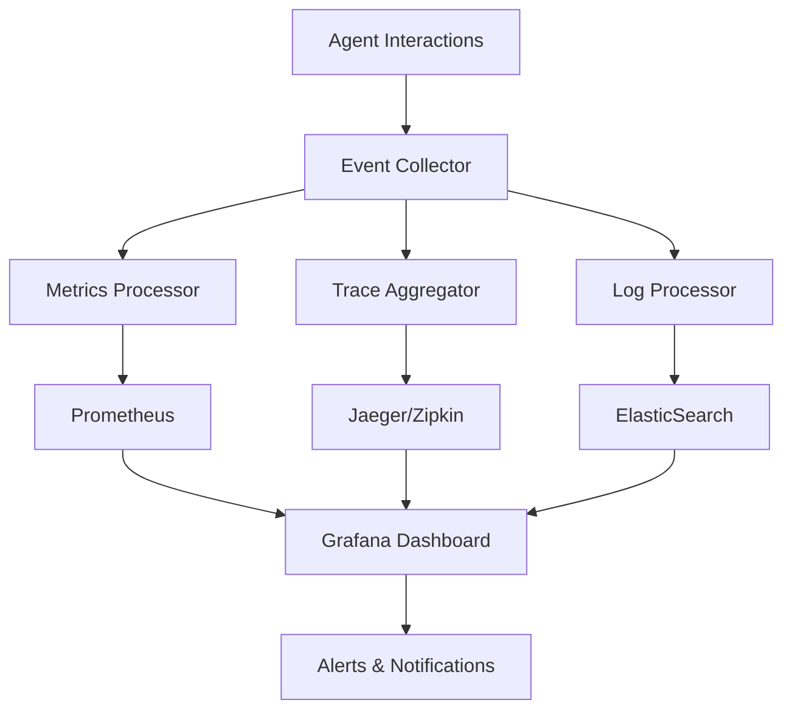

# Observability

Enterprise-grade observability for monitoring, debugging, and optimizing AI agent performance in production environments.

## 📊 What is Observability?

Observability in Niflheim-X provides:

- **📈 Real-time monitoring** of agent performance
- **🔍 Detailed logging** and tracing capabilities  
- **📊 Metrics collection** and visualization
- **🚨 Alerting** for performance issues
- **📋 Audit trails** for compliance
- **🔧 Debugging tools** for troubleshooting

## 🏗️ Observability Architecture



## 🚀 Getting Started

### Basic Setup

```python
from niflheim_x import Agent, OpenAILLM, ObservabilityConfig
from niflheim_x.enterprise import ObservabilityManager

# Configure observability
obs_config = ObservabilityConfig(
    enable_metrics=True,
    enable_tracing=True,
    enable_logging=True,
    service_name="my-ai-service",
    environment="production"
)

# Initialize observability manager
obs_manager = ObservabilityManager(config=obs_config)

# Create instrumented agent
agent = Agent(
    name="ProductionBot",
    llm=OpenAILLM(model="gpt-4", api_key="..."),
    observability=obs_manager
)

# All interactions are now monitored
response = await agent.chat("Hello, world!")
```

### Advanced Configuration

```python
from niflheim_x.enterprise import (
    ObservabilityManager,
    PrometheusExporter,
    JaegerTracer,
    StructuredLogger
)

# Advanced observability setup
obs_manager = ObservabilityManager(
    metrics_exporter=PrometheusExporter(
        host="localhost",
        port=8000,
        namespace="niflheim_x"
    ),
    tracer=JaegerTracer(
        service_name="ai-agents",
        agent_host="jaeger-agent",
        agent_port=14268
    ),
    logger=StructuredLogger(
        level="INFO",
        format="json",
        output="elasticsearch",
        elasticsearch_url="http://localhost:9200"
    ),
    sampling_rate=1.0,  # 100% sampling for production
    custom_tags={
        "team": "ai-platform",
        "version": "1.0.0"
    }
)
```

## 📊 Metrics Collection

### Core Metrics

Niflheim-X automatically collects these essential metrics:

```python
# Conversation Metrics
conversation_count = Counter(
    name="conversations_total",
    description="Total number of conversations",
    labels=["agent_name", "status"]
)

conversation_duration = Histogram(
    name="conversation_duration_seconds",
    description="Duration of conversations",
    labels=["agent_name"],
    buckets=[0.1, 0.5, 1.0, 2.0, 5.0, 10.0, 30.0]
)

# LLM Metrics
llm_requests = Counter(
    name="llm_requests_total",
    description="Total LLM requests",
    labels=["provider", "model", "status"]
)

llm_latency = Histogram(
    name="llm_latency_seconds",
    description="LLM request latency",
    labels=["provider", "model"],
    buckets=[0.1, 0.5, 1.0, 2.0, 5.0, 10.0]
)

token_usage = Counter(
    name="tokens_used_total",
    description="Total tokens used",
    labels=["provider", "model", "type"]  # type: prompt/completion
)

# Tool Metrics
tool_executions = Counter(
    name="tool_executions_total",
    description="Total tool executions",
    labels=["tool_name", "status"]
)

tool_duration = Histogram(
    name="tool_duration_seconds",
    description="Tool execution duration",
    labels=["tool_name"]
)

# Memory Metrics
memory_operations = Counter(
    name="memory_operations_total",
    description="Memory operations",
    labels=["operation", "backend", "status"]
)

memory_size = Gauge(
    name="memory_size_bytes",
    description="Memory storage size",
    labels=["backend", "session"]
)
```

### Custom Metrics

```python
from niflheim_x.enterprise import MetricsCollector

class CustomMetrics:
    def __init__(self, collector: MetricsCollector):
        self.collector = collector
        
        # Business-specific metrics
        self.user_satisfaction = collector.create_histogram(
            name="user_satisfaction_score",
            description="User satisfaction ratings",
            labels=["agent_name", "category"],
            buckets=[1, 2, 3, 4, 5]
        )
        
        self.resolution_rate = collector.create_counter(
            name="issue_resolution_total",
            description="Issues resolved successfully",
            labels=["category", "complexity"]
        )
    
    def record_satisfaction(self, agent_name: str, category: str, score: float):
        self.user_satisfaction.observe(score, {"agent_name": agent_name, "category": category})
    
    def record_resolution(self, category: str, complexity: str):
        self.resolution_rate.inc({"category": category, "complexity": complexity})

# Use custom metrics
custom_metrics = CustomMetrics(obs_manager.metrics_collector)

# Record business metrics
custom_metrics.record_satisfaction("support_bot", "technical", 4.5)
custom_metrics.record_resolution("billing", "simple")
```

## 🔍 Distributed Tracing

### Automatic Tracing

```python
# Traces are automatically created for:
# - Agent conversations
# - LLM requests  
# - Tool executions
# - Memory operations

# View trace hierarchy:
# Conversation Span
# ├── LLM Request Span
# │   ├── Token Encoding Span
# │   ├── API Call Span
# │   └── Response Processing Span
# ├── Tool Execution Span
# │   ├── Parameter Validation Span
# │   ├── Function Call Span
# │   └── Result Processing Span
# └── Memory Update Span
```

### Custom Tracing

```python
from niflheim_x.enterprise import create_span, get_current_span

async def custom_business_logic(data):
    # Create custom span
    with create_span("business_logic", tags={"operation": "data_processing"}) as span:
        span.set_tag("data_size", len(data))
        
        # Add custom events
        span.add_event("processing_started", {"timestamp": time.time()})
        
        try:
            result = await process_data(data)
            span.set_tag("success", True)
            span.add_event("processing_completed")
            return result
        
        except Exception as e:
            span.set_tag("success", False)
            span.set_tag("error", str(e))
            span.add_event("processing_failed", {"error": str(e)})
            raise

# Correlate with parent spans
async def handle_request(user_input):
    current_span = get_current_span()
    current_span.set_tag("user_id", "user_123")
    
    # All nested operations will be correlated
    result = await custom_business_logic(user_input)
    return result
```

### Cross-Service Tracing

```python
# Propagate trace context across services
import requests
from niflheim_x.enterprise import inject_trace_headers

async def call_external_service(data):
    headers = {}
    inject_trace_headers(headers)  # Add trace context
    
    response = requests.post(
        "https://external-service.com/api",
        json=data,
        headers=headers
    )
    
    return response.json()

# Extract trace context in receiving service
from niflheim_x.enterprise import extract_trace_context

def service_endpoint(request):
    # Extract parent trace context
    trace_context = extract_trace_context(request.headers)
    
    with create_span("external_service_call", parent=trace_context):
        # Process request with proper trace correlation
        return process_request(request.data)
```

## 📋 Structured Logging

### Automatic Logging

```python
# Niflheim-X automatically logs:
{
    "timestamp": "2024-01-15T10:30:00Z",
    "level": "INFO",
    "service": "ai-agents",
    "trace_id": "abc123",
    "span_id": "def456",
    "agent_name": "support_bot",
    "event": "conversation_started",
    "user_id": "user_123",
    "session_id": "session_456",
    "metadata": {
        "channel": "web",
        "language": "en"
    }
}

{
    "timestamp": "2024-01-15T10:30:05Z",
    "level": "INFO", 
    "service": "ai-agents",
    "trace_id": "abc123",
    "span_id": "ghi789",
    "event": "llm_request",
    "provider": "openai",
    "model": "gpt-4",
    "tokens": {
        "prompt": 150,
        "completion": 75,
        "total": 225
    },
    "latency_ms": 2500,
    "cost_usd": 0.0135
}
```

### Custom Logging

```python
from niflheim_x.enterprise import get_logger

logger = get_logger(__name__)

async def business_operation(user_id: str, operation: str):
    # Structured logging with automatic trace correlation
    logger.info(
        "Business operation started",
        extra={
            "user_id": user_id,
            "operation": operation,
            "timestamp": time.time()
        }
    )
    
    try:
        result = await perform_operation()
        
        logger.info(
            "Business operation completed",
            extra={
                "user_id": user_id,
                "operation": operation,
                "result_size": len(result),
                "success": True
            }
        )
        
        return result
        
    except Exception as e:
        logger.error(
            "Business operation failed",
            extra={
                "user_id": user_id,
                "operation": operation,
                "error": str(e),
                "error_type": type(e).__name__,
                "success": False
            },
            exc_info=True
        )
        raise
```

## 🚨 Alerting & Monitoring

### Built-in Alerts

```python
from niflheim_x.enterprise import AlertManager, AlertRule

alert_manager = AlertManager(
    webhook_url="https://slack.com/hooks/...",
    email_config={
        "smtp_server": "smtp.company.com",
        "recipients": ["team@company.com"]
    }
)

# Define alert rules
alert_rules = [
    AlertRule(
        name="High Error Rate",
        query="rate(llm_requests_total{status='error'}[5m]) > 0.1",
        duration="2m",
        severity="critical",
        message="LLM error rate is above 10% for 2 minutes"
    ),
    
    AlertRule(
        name="High Latency",
        query="histogram_quantile(0.95, llm_latency_seconds) > 10",
        duration="5m",
        severity="warning",
        message="95th percentile LLM latency is above 10 seconds"
    ),
    
    AlertRule(
        name="Token Usage Spike",
        query="increase(tokens_used_total[1h]) > 1000000",
        duration="1m",
        severity="warning",
        message="Token usage increased by more than 1M in the last hour"
    )
]

alert_manager.add_rules(alert_rules)
```

### Custom Alerting

```python
class CustomAlertHandler:
    def __init__(self, obs_manager):
        self.obs_manager = obs_manager
        self.thresholds = {
            "conversation_duration": 30.0,  # seconds
            "error_rate": 0.05,             # 5%
            "cost_per_hour": 100.0          # USD
        }
    
    async def check_conversation_duration(self, duration: float, agent_name: str):
        if duration > self.thresholds["conversation_duration"]:
            await self.send_alert(
                severity="warning",
                message=f"Long conversation detected for {agent_name}: {duration:.2f}s",
                tags={"agent_name": agent_name, "duration": duration}
            )
    
    async def check_cost_threshold(self, hourly_cost: float):
        if hourly_cost > self.thresholds["cost_per_hour"]:
            await self.send_alert(
                severity="critical",
                message=f"Hourly cost exceeded threshold: ${hourly_cost:.2f}",
                tags={"cost": hourly_cost, "period": "hourly"}
            )
    
    async def send_alert(self, severity: str, message: str, tags: dict):
        # Send to monitoring system
        alert_data = {
            "timestamp": time.time(),
            "severity": severity,
            "message": message,
            "service": "niflheim-x",
            "tags": tags
        }
        
        # Multiple notification channels
        await self.notify_slack(alert_data)
        await self.notify_pagerduty(alert_data)
        await self.store_alert(alert_data)
```

## 📈 Dashboard & Visualization

### Grafana Integration

```python
# Pre-built Grafana dashboards for:
# - Agent Performance Overview
# - LLM Usage & Costs
# - Tool Execution Metrics  
# - Memory System Health
# - Error Analysis
# - Business KPIs

# Dashboard configuration
grafana_config = {
    "datasources": [
        {
            "name": "Prometheus",
            "type": "prometheus", 
            "url": "http://prometheus:9090"
        },
        {
            "name": "Jaeger",
            "type": "jaeger",
            "url": "http://jaeger:16686"
        }
    ],
    "dashboards": [
        "agent-overview.json",
        "llm-metrics.json", 
        "tool-performance.json",
        "business-kpis.json"
    ]
}

# Auto-provision dashboards
from niflheim_x.enterprise import GrafanaProvisioner

provisioner = GrafanaProvisioner(config=grafana_config)
await provisioner.setup_dashboards()
```

### Custom Dashboards

```python
# Create custom dashboard panels
dashboard_panels = [
    {
        "title": "Conversation Success Rate",
        "type": "stat",
        "targets": [
            {
                "expr": "rate(conversations_total{status='success'}[5m]) / rate(conversations_total[5m])",
                "legendFormat": "Success Rate"
            }
        ]
    },
    {
        "title": "Average Response Time",
        "type": "graph",
        "targets": [
            {
                "expr": "histogram_quantile(0.50, conversation_duration_seconds)",
                "legendFormat": "50th percentile"
            },
            {
                "expr": "histogram_quantile(0.95, conversation_duration_seconds)", 
                "legendFormat": "95th percentile"
            }
        ]
    },
    {
        "title": "Cost Per Hour",
        "type": "bargauge",
        "targets": [
            {
                "expr": "sum(rate(llm_cost_usd[1h])) by (model)",
                "legendFormat": "{{model}}"
            }
        ]
    }
]
```

## 🔧 Performance Analysis

### Bottleneck Detection

```python
from niflheim_x.enterprise import PerformanceAnalyzer

analyzer = PerformanceAnalyzer(obs_manager)

# Analyze conversation performance
analysis = await analyzer.analyze_conversation_performance(
    time_range="1h",
    agent_names=["support_bot", "sales_bot"]
)

print(f"Slowest operations:")
for operation in analysis.slowest_operations:
    print(f"  {operation.name}: {operation.avg_duration:.2f}s")

print(f"Error hotspots:")
for error in analysis.error_hotspots:
    print(f"  {error.operation}: {error.rate:.2%} error rate")

# Identify optimization opportunities
recommendations = analyzer.get_optimization_recommendations(analysis)
for rec in recommendations:
    print(f"💡 {rec.title}: {rec.description}")
```

### A/B Testing Support

```python
from niflheim_x.enterprise import ABTestTracker

ab_tracker = ABTestTracker(obs_manager)

# Define A/B test
test_config = {
    "test_name": "model_comparison",
    "variants": {
        "control": {"model": "gpt-3.5-turbo", "weight": 0.5},
        "treatment": {"model": "gpt-4", "weight": 0.5}
    },
    "metrics": ["response_time", "user_satisfaction", "cost"]
}

ab_tracker.create_test(test_config)

# Track variant assignment
async def handle_request(user_id: str, message: str):
    variant = ab_tracker.assign_variant("model_comparison", user_id)
    
    # Use variant configuration
    llm_config = test_config["variants"][variant]
    llm = OpenAILLM(model=llm_config["model"])
    
    # Track test metrics
    with ab_tracker.track_test("model_comparison", variant, user_id):
        response = await agent.chat(message)
        return response

# Analyze test results
results = await ab_tracker.analyze_test("model_comparison")
print(f"Control vs Treatment:")
print(f"  Response Time: {results.control.avg_response_time:.2f}s vs {results.treatment.avg_response_time:.2f}s")
print(f"  Satisfaction: {results.control.avg_satisfaction:.2f} vs {results.treatment.avg_satisfaction:.2f}")
print(f"  Cost: ${results.control.avg_cost:.4f} vs ${results.treatment.avg_cost:.4f}")
```

## 🎯 Best Practices

### 1. **Sampling Strategy**

```python
# Configure appropriate sampling rates
obs_config = ObservabilityConfig(
    tracing_sampling_rate=0.1,    # 10% for high-volume systems
    metrics_sampling_rate=1.0,    # Always collect metrics
    logging_sampling_rate=1.0,    # Always log errors
    
    # Adaptive sampling based on service health
    adaptive_sampling=True,
    error_boost_factor=2.0,       # Increase sampling during errors
)
```

### 2. **Data Retention**

```python
# Configure retention policies
retention_config = {
    "metrics": "30d",       # 30 days for metrics
    "traces": "7d",         # 7 days for traces
    "logs": "90d",          # 90 days for logs
    "alerts": "1y",         # 1 year for alert history
}
```

### 3. **Privacy & Security**

```python
# Sanitize sensitive data
from niflheim_x.enterprise import DataSanitizer

sanitizer = DataSanitizer(
    pii_fields=["email", "phone", "ssn"],
    redaction_patterns=[
        r"\b\d{3}-\d{2}-\d{4}\b",  # SSN pattern
        r"\b[A-Za-z0-9._%+-]+@[A-Za-z0-9.-]+\.[A-Z|a-z]{2,}\b"  # Email
    ]
)

obs_manager.add_data_processor(sanitizer)
```

## 🚀 Next Steps

- Explore [Security & Compliance](./security) for enterprise security features
- Learn about [Multi-Agent Orchestration](./orchestration) for complex workflows
- Check out [Performance Optimization](../guides/performance) for scaling strategies
- See [Deployment Guide](../guides/deployment) for production setup