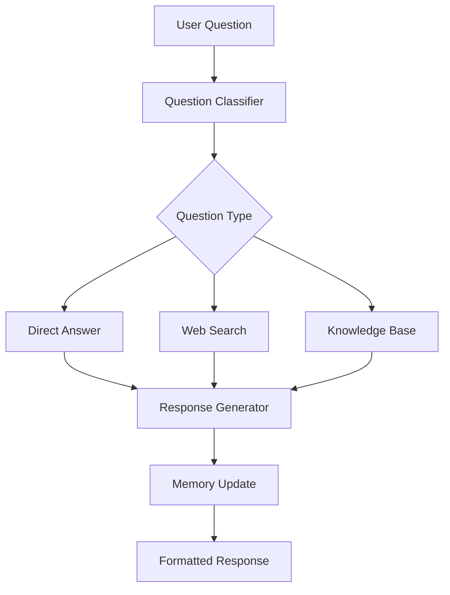

# Simple Q&A Bot

Build a sophisticated question-answering bot with conversation memory, web search capabilities, and intelligent response routing.

## 🎯 Overview

This example demonstrates how to create a smart Q&A bot that can:

- **💬 Maintain conversation context** across multiple questions
- **🔍 Search the web** for current information
- **📚 Access knowledge bases** and documentation
- **🧠 Route questions** to appropriate response strategies
- **💾 Remember** user preferences and conversation history

## 🏗️ Architecture



## 🚀 Complete Implementation

### 1. Basic Setup

```python
import asyncio
import os
import json
import requests
from typing import Optional, List, Dict, Any
from datetime import datetime
from niflheim_x import Agent, OpenAILLM, SQLiteMemory, Tool

# Configuration
class QABotConfig:
    def __init__(self):
        self.openai_api_key = os.getenv("OPENAI_API_KEY")
        self.search_api_key = os.getenv("SEARCH_API_KEY")  # e.g., Serper, SerpAPI
        self.knowledge_base_path = "./knowledge_base"
        self.memory_db_path = "./qa_bot_memory.db"
        self.max_search_results = 5
        self.response_temperature = 0.7

config = QABotConfig()
```

### 2. Search and Knowledge Tools

```python
class SearchTools:
    def __init__(self, config: QABotConfig):
        self.config = config
        self.search_api_key = config.search_api_key
    
    def search_web(self, query: str, num_results: int = 5) -> str:
        """Search the web for current information."""
        try:
            if not self.search_api_key:
                return "Web search is not available - missing API key"
            
            # Using Serper API as example
            url = "https://google.serper.dev/search"
            headers = {
                "X-API-KEY": self.search_api_key,
                "Content-Type": "application/json"
            }
            
            payload = {
                "q": query,
                "num": num_results
            }
            
            response = requests.post(url, headers=headers, json=payload, timeout=10)
            response.raise_for_status()
            
            data = response.json()
            results = []
            
            # Extract organic results
            for i, result in enumerate(data.get("organic", []), 1):
                title = result.get("title", "No title")
                snippet = result.get("snippet", "No description")
                link = result.get("link", "")
                
                results.append(f"{i}. **{title}**\n   {snippet}\n   Source: {link}")
            
            if not results:
                return "No search results found"
            
            return f"Web search results for '{query}':\n\n" + "\n\n".join(results)
            
        except Exception as e:
            return f"Search error: {str(e)}"
    
    def search_knowledge_base(self, query: str) -> str:
        """Search local knowledge base files."""
        try:
            knowledge_path = self.config.knowledge_base_path
            if not os.path.exists(knowledge_path):
                return "Knowledge base not found"
            
            # Simple file search (in production, use vector search)
            relevant_content = []
            query_lower = query.lower()
            
            for filename in os.listdir(knowledge_path):
                if filename.endswith(('.txt', '.md')):
                    filepath = os.path.join(knowledge_path, filename)
                    try:
                        with open(filepath, 'r', encoding='utf-8') as f:
                            content = f.read()
                            
                        # Simple keyword matching
                        if any(keyword in content.lower() for keyword in query_lower.split()):
                            # Extract relevant paragraph
                            lines = content.split('\n')
                            for i, line in enumerate(lines):
                                if any(keyword in line.lower() for keyword in query_lower.split()):
                                    # Get context around matching line
                                    start = max(0, i - 2)
                                    end = min(len(lines), i + 3)
                                    context = '\n'.join(lines[start:end])
                                    
                                    relevant_content.append(f"From {filename}:\n{context}")
                                    break
                    except Exception:
                        continue
            
            if not relevant_content:
                return "No relevant information found in knowledge base"
            
            return "Knowledge base results:\n\n" + "\n\n---\n\n".join(relevant_content[:3])
            
        except Exception as e:
            return f"Knowledge base search error: {str(e)}"

    def get_current_datetime(self) -> str:
        """Get current date and time."""
        return f"Current date and time: {datetime.now().strftime('%Y-%m-%d %H:%M:%S')}"

    def calculate_math(self, expression: str) -> str:
        """Safely evaluate mathematical expressions."""
        try:
            # Whitelist safe operations
            allowed_chars = set('0123456789+-*/()., ')
            if not all(c in allowed_chars for c in expression):
                return "Error: Invalid characters in expression"
            
            # Evaluate safely
            result = eval(expression, {"__builtins__": {}}, {})
            return f"Calculation result: {expression} = {result}"
            
        except Exception as e:
            return f"Math error: {str(e)}"
```

### 3. Question Classification

```python
class QuestionClassifier:
    """Classify questions to route to appropriate response strategy."""
    
    def __init__(self):
        self.patterns = {
            'current_info': [
                'today', 'now', 'current', 'latest', 'recent', 'news',
                'weather', 'stock', 'price', 'happening'
            ],
            'math': [
                'calculate', 'compute', 'math', 'equation', 'solve',
                '+', '-', '*', '/', '=', 'sum', 'multiply'
            ],
            'datetime': [
                'time', 'date', 'when', 'day', 'month', 'year',
                'clock', 'calendar'
            ],
            'knowledge': [
                'what is', 'explain', 'define', 'how does', 'why',
                'concept', 'theory', 'principle'
            ]
        }
    
    def classify(self, question: str) -> List[str]:
        """Classify question and return applicable categories."""
        question_lower = question.lower()
        categories = []
        
        for category, keywords in self.patterns.items():
            if any(keyword in question_lower for keyword in keywords):
                categories.append(category)
        
        # Default to knowledge + web search if no specific pattern
        if not categories:
            categories = ['knowledge', 'current_info']
        
        return categories
```

### 4. Smart Q&A Agent

```python
class SmartQABot:
    def __init__(self, config: QABotConfig):
        self.config = config
        self.search_tools = SearchTools(config)
        self.classifier = QuestionClassifier()
        
        # Setup memory
        self.memory = SQLiteMemory(
            db_path=config.memory_db_path,
            session_id="qa_session",
            max_messages=200
        )
        
        # Setup LLM
        self.llm = OpenAILLM(
            model="gpt-4",
            api_key=config.openai_api_key,
            temperature=config.response_temperature
        )
        
        # Create agent
        self.agent = Agent(
            name="QABot",
            llm=self.llm,
            memory=self.memory,
            system_prompt=self._get_system_prompt(),
            enable_streaming=True
        )
        
        # Register tools
        self._register_tools()
    
    def _get_system_prompt(self) -> str:
        return """You are an intelligent Q&A assistant with access to various tools and information sources.

Your capabilities:
- Answer questions using your knowledge
- Search the web for current information
- Search knowledge bases for specific topics
- Perform mathematical calculations
- Provide current date/time information

Guidelines:
1. For current events, news, or recent information, use web search
2. For mathematical problems, use the calculator tool
3. For time/date questions, use the datetime tool
4. For general knowledge, try knowledge base first, then supplement with web search if needed
5. Always be accurate and cite your sources when using external information
6. If you're unsure, acknowledge uncertainty and suggest the user verify information
7. Maintain conversation context and refer to previous exchanges when relevant

Respond in a helpful, conversational tone while being precise and informative."""
    
    def _register_tools(self):
        """Register all available tools with the agent."""
        tools = [
            Tool.from_function(
                function=self.search_tools.search_web,
                name="search_web",
                description="Search the web for current information, news, and real-time data"
            ),
            Tool.from_function(
                function=self.search_tools.search_knowledge_base,
                name="search_knowledge_base", 
                description="Search local knowledge base for specific topics and concepts"
            ),
            Tool.from_function(
                function=self.search_tools.get_current_datetime,
                name="get_datetime",
                description="Get the current date and time"
            ),
            Tool.from_function(
                function=self.search_tools.calculate_math,
                name="calculate",
                description="Perform mathematical calculations safely"
            )
        ]
        
        for tool in tools:
            self.agent.register_tool(tool)
    
    async def answer_question(self, question: str) -> str:
        """Process a question and return a comprehensive answer."""
        try:
            # Classify the question to understand intent
            categories = self.classifier.classify(question)
            
            # Add classification context to help the agent choose appropriate tools
            enhanced_question = f"""Question: {question}

Based on analysis, this question appears to be about: {', '.join(categories)}

Please provide a comprehensive answer using appropriate tools as needed."""
            
            # Get response from agent
            response = await self.agent.chat(enhanced_question)
            return response.content
            
        except Exception as e:
            return f"I apologize, but I encountered an error while processing your question: {str(e)}"
    
    async def stream_answer(self, question: str):
        """Stream the answer for real-time response."""
        try:
            categories = self.classifier.classify(question)
            enhanced_question = f"""Question: {question}

Based on analysis, this question appears to be about: {', '.join(categories)}

Please provide a comprehensive answer using appropriate tools as needed."""
            
            async for chunk in self.agent.stream(enhanced_question):
                yield chunk
                
        except Exception as e:
            # Return error as a chunk
            from niflheim_x import LLMResponse
            yield LLMResponse(
                content=f"Error: {str(e)}",
                role="assistant",
                finished=True
            )
    
    async def get_conversation_summary(self) -> str:
        """Get a summary of the current conversation."""
        try:
            history = await self.memory.get_messages("qa_session", limit=20)
            if not history:
                return "No conversation history yet."
            
            # Create summary prompt
            summary_prompt = "Please provide a brief summary of our conversation so far, highlighting the main topics discussed and key information shared."
            
            response = await self.agent.chat(summary_prompt)
            return response.content
            
        except Exception as e:
            return f"Error generating summary: {str(e)}"
    
    async def clear_conversation(self):
        """Clear the conversation history."""
        await self.memory.clear_session("qa_session")
```

### 5. Interactive Chat Interface

```python
class QAChatInterface:
    def __init__(self, qa_bot: SmartQABot):
        self.qa_bot = qa_bot
        self.conversation_active = True
    
    async def start(self):
        """Start the interactive chat interface."""
        print("🤖 Smart Q&A Bot")
        print("=" * 50)
        print("I can help you with:")
        print("• General questions and explanations")
        print("• Current events and news")
        print("• Mathematical calculations") 
        print("• Date and time information")
        print("• Knowledge base searches")
        print("\nCommands: 'quit', 'clear', 'summary', 'help'")
        print("=" * 50)
        
        await self._chat_loop()
    
    async def _chat_loop(self):
        """Main chat interaction loop."""
        while self.conversation_active:
            try:
                # Get user input
                question = input("\n❓ Your question: ").strip()
                
                if not question:
                    continue
                
                # Handle special commands
                if await self._handle_command(question):
                    continue
                
                # Process question with streaming
                print("\n🤖 Answer: ", end="", flush=True)
                
                full_response = ""
                async for chunk in self.qa_bot.stream_answer(question):
                    if chunk.content:
                        print(chunk.content, end="", flush=True)
                        full_response += chunk.content
                    
                    if chunk.finished:
                        print("\n")
                        break
                
            except KeyboardInterrupt:
                print("\n\nGoodbye! 👋")
                break
            except Exception as e:
                print(f"\n❌ Error: {e}")
    
    async def _handle_command(self, command: str) -> bool:
        """Handle special commands. Returns True if command was handled."""
        command = command.lower()
        
        if command == 'quit' or command == 'exit':
            print("Goodbye! 👋")
            self.conversation_active = False
            return True
        
        elif command == 'clear':
            await self.qa_bot.clear_conversation()
            print("🔄 Conversation history cleared!")
            return True
        
        elif command == 'summary':
            print("\n📋 Conversation Summary:")
            summary = await self.qa_bot.get_conversation_summary()
            print(summary)
            return True
        
        elif command == 'help':
            self._show_help()
            return True
        
        return False
    
    def _show_help(self):
        """Show help information."""
        print("""
🆘 Help & Commands:

Available Commands:
• quit/exit - End the conversation
• clear - Clear conversation history
• summary - Get conversation summary
• help - Show this help message

Question Types I Handle:
• Current Information: "What's the latest news about AI?"
• Calculations: "Calculate 15% of 250"
• Time/Date: "What time is it?"
• General Knowledge: "Explain quantum computing"
• Concepts: "How does machine learning work?"

Tips:
• Be specific in your questions for better answers
• I remember our conversation, so you can ask follow-up questions
• I'll search the web for current information when needed
• I can access my knowledge base for detailed explanations
        """)
```

### 6. Main Application

```python
async def main():
    """Main application entry point."""
    try:
        # Initialize configuration
        config = QABotConfig()
        
        # Verify API key
        if not config.openai_api_key:
            print("❌ Error: OPENAI_API_KEY environment variable not set")
            print("Please set your OpenAI API key: export OPENAI_API_KEY='your-key-here'")
            return
        
        # Create knowledge base directory if it doesn't exist
        os.makedirs(config.knowledge_base_path, exist_ok=True)
        
        # Initialize Q&A bot
        print("🚀 Initializing Smart Q&A Bot...")
        qa_bot = SmartQABot(config)
        
        # Start chat interface
        chat_interface = QAChatInterface(qa_bot)
        await chat_interface.start()
        
    except Exception as e:
        print(f"❌ Failed to start Q&A Bot: {e}")

if __name__ == "__main__":
    asyncio.run(main())
```

## 📁 Knowledge Base Setup

Create sample knowledge base files:

### knowledge_base/machine_learning.md

```markdown
# Machine Learning Fundamentals

Machine learning is a subset of artificial intelligence that enables computers to learn and improve from experience without being explicitly programmed.

## Types of Machine Learning

1. **Supervised Learning**: Learning with labeled training data
2. **Unsupervised Learning**: Finding patterns in unlabeled data  
3. **Reinforcement Learning**: Learning through interaction and rewards

## Common Algorithms

- Linear Regression
- Decision Trees
- Neural Networks
- Support Vector Machines
- Random Forest
```

### knowledge_base/python_programming.md

```markdown
# Python Programming Guide

Python is a high-level, interpreted programming language known for its simplicity and readability.

## Key Features

- Easy to learn and use
- Extensive standard library
- Cross-platform compatibility
- Strong community support

## Common Use Cases

- Web development
- Data science and analytics
- Machine learning and AI
- Automation and scripting
```

## 🔧 Environment Setup

Create a `.env` file:

```env
# Required
OPENAI_API_KEY=sk-your-openai-api-key-here

# Optional - for web search functionality
SEARCH_API_KEY=your-search-api-key-here

# Optional - customize paths
KNOWLEDGE_BASE_PATH=./knowledge_base
MEMORY_DB_PATH=./qa_bot_memory.db
```

Install dependencies:

```bash
pip install niflheim-x requests python-dotenv
```

## 🚀 Running the Bot

```bash
python qa_bot.py
```

## 💡 Example Interactions

```
❓ Your question: What's the weather like in New York today?

🤖 Answer: I'll search for current weather information in New York for you.

[Uses web search tool]

Based on the latest information, New York is currently experiencing...

❓ Your question: Calculate 15% tip on a $85.50 bill

🤖 Answer: I'll calculate that for you.

[Uses calculator tool]

For a bill of $85.50 with a 15% tip:
- Tip amount: $12.83
- Total amount: $98.33

❓ Your question: Explain machine learning

🤖 Answer: Let me search our knowledge base for information about machine learning.

[Uses knowledge base search]

Machine learning is a subset of artificial intelligence that enables computers to learn and improve from experience without being explicitly programmed...
```

## 🎯 Customization Options

### 1. Add More Tools

```python
def get_stock_price(symbol: str) -> str:
    """Get current stock price."""
    # Implement using a stock API
    pass

def translate_text(text: str, target_language: str) -> str:
    """Translate text to target language."""
    # Implement using translation API
    pass

# Register additional tools
agent.register_tool(Tool.from_function(get_stock_price, name="stock_price"))
agent.register_tool(Tool.from_function(translate_text, name="translate"))
```

### 2. Enhance Knowledge Base

```python
# Use vector embeddings for better search
from niflheim_x import VectorMemory

knowledge_memory = VectorMemory(
    provider="openai",
    api_key=config.openai_api_key,
    index_name="knowledge_base"
)

# Index knowledge base documents
for doc in knowledge_docs:
    await knowledge_memory.add_document(doc)
```

### 3. Add Response Caching

```python
import hashlib
from datetime import datetime, timedelta

class CachedQABot(SmartQABot):
    def __init__(self, *args, **kwargs):
        super().__init__(*args, **kwargs)
        self.cache = {}
        self.cache_ttl = timedelta(hours=1)
    
    async def answer_question(self, question: str) -> str:
        # Check cache first
        cache_key = hashlib.md5(question.encode()).hexdigest()
        
        if cache_key in self.cache:
            cached_response, timestamp = self.cache[cache_key]
            if datetime.now() - timestamp < self.cache_ttl:
                return f"[Cached] {cached_response}"
        
        # Get fresh response
        response = await super().answer_question(question)
        
        # Cache the response
        self.cache[cache_key] = (response, datetime.now())
        
        return response
```

## 🚀 Next Steps

- **[Tool Development](../core/tools)** - Create custom tools for your domain
- **[Memory Systems](../core/memory)** - Implement advanced memory backends
- **[Enterprise Features](../enterprise/observability)** - Add monitoring and analytics
- **[Multi-Agent Examples](./multi-agent-conversation)** - Build complex agent interactions